# WorkmanTrak.


## Description
WorkmanTrak is a node application for maintaining a companies employee database.

    The motivation behind the WorkmanTrak application was to better familiarize myself with mysql and querying with the sql language.

    WorkmanTrak aims to provide a company with an easy to use interface for updating and maintaining their departments, roles, and employees.

    The development of WorkmanTrak was a bit arduous. It has certainly been the most challenging application I have built to date. Understanding and properly querying databases is such a useful skill, but it takes time to really master!


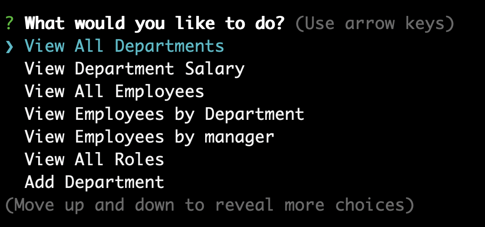
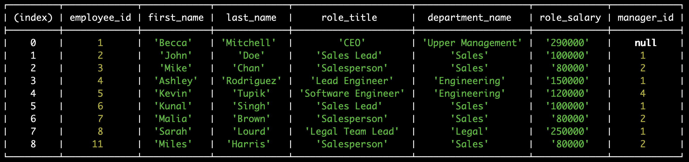
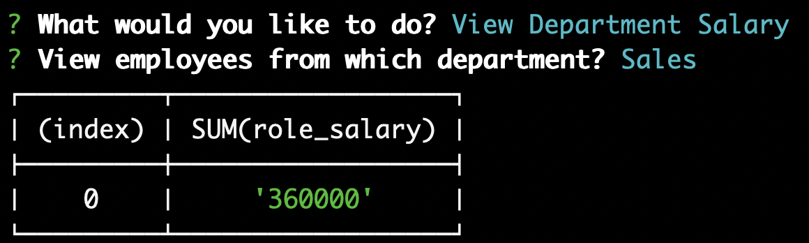
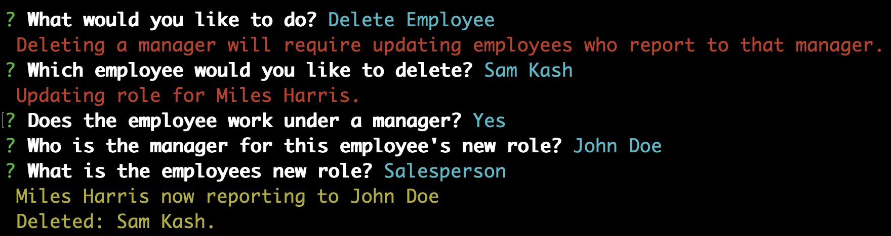
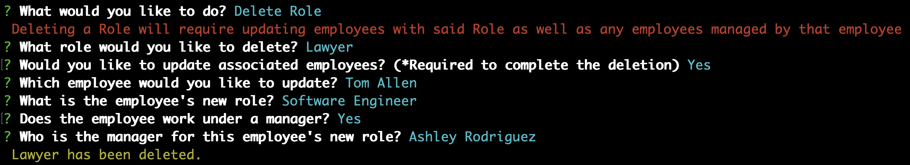<br/>

## Table of Contents

* **[Installation](#installation)**<br />
* **[Usage](#usage)**<br />
* **[License](#license)**<br />
* **[Contributing](#contributing)**<br />
* **[Contact](#contact)**<br />

### Installation
<a name="installation"/>

```
npm i
```

### Usage
<a name="usage"/>
Initialize WorkmanTrak by inputing "node app.js" in your terminal. Be sure you've navigated to the file location! Then simply navigate the menu answering prompts and let WorkmanTrak handle all the hard work!<br/>

WorkmanTrak starts with a custom Database Class. This is where I have built the methods needed to utilize the database. As you can see below we have a method to connect, query, and drop connection.<br/>
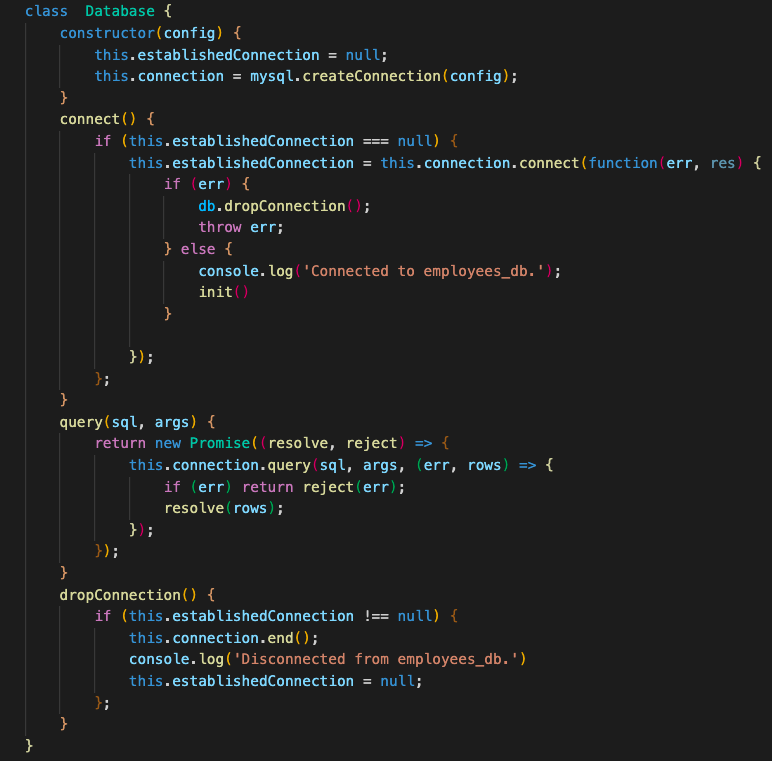<br/>
After displaying the WorkmanTrak title, the user will be prompted with the main menu.<br/>

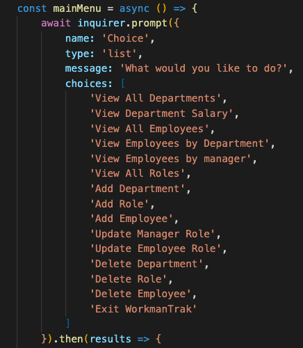<br/>
Here are code examples for a few of the various functions needed to perform WorkmanTrak's management of the database.<br/>
Add a role.
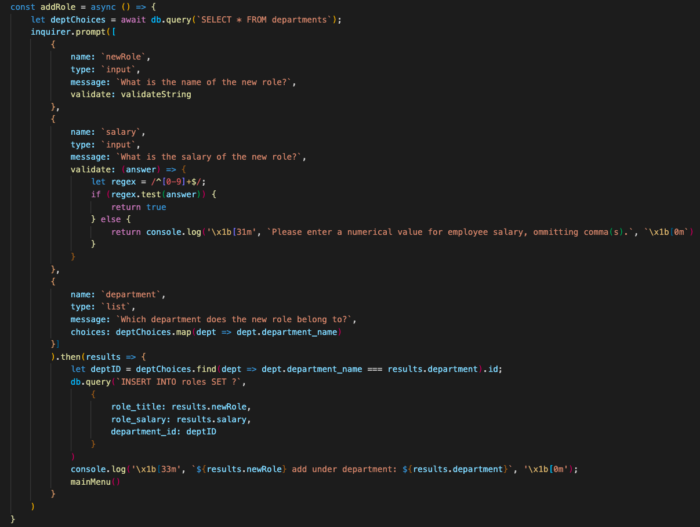<br/>
Delete a department.
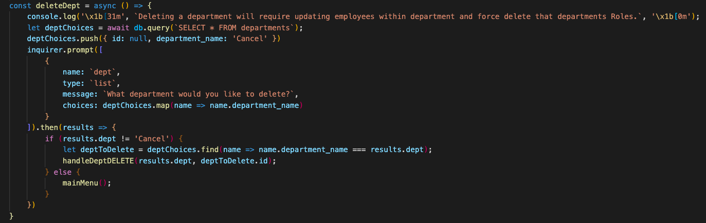<br/>
View department salary.
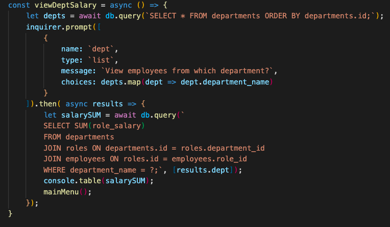<br/>
View employees.
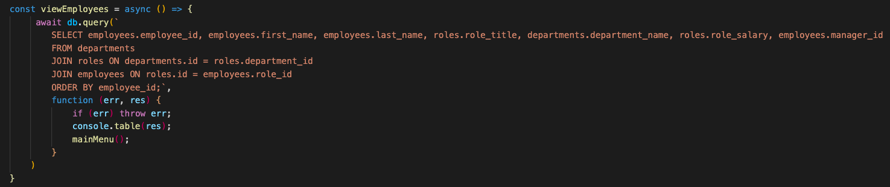<br/>

### License
<a name="license"/>

<a href="https://choosealicense.com/licenses/mit/">mit</a><br/>
            For more information on the coverage of this license please click on the link above.

### Contributing
<a name="contributing"/>
hackpres is the primary contributor.


### Contact
<a name="contact"/>
for questions please contact <a href="https://github.com/hackpres">hackpres</a><br/>

